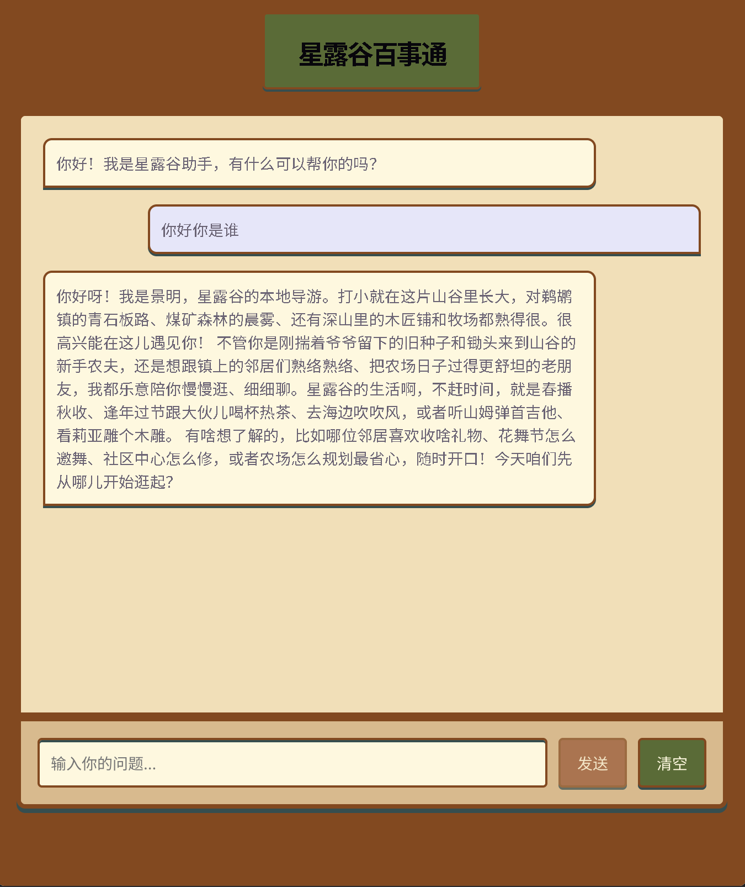
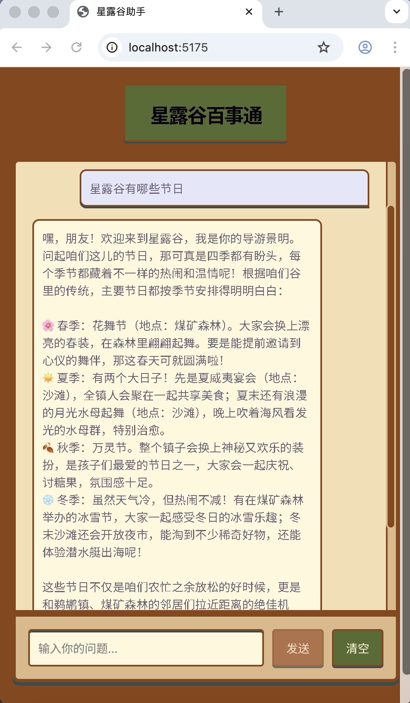
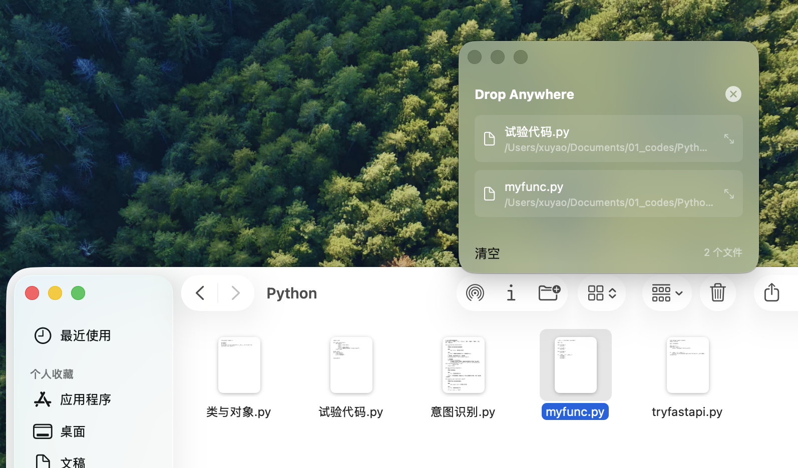

# 👋 你好，我是徐尧 | 个人开发者

## 🚀 关于我

我是一名充满创造力的软件开发者，专注于从用户角度出发创造可改变生活的小应用。凭借扎实的计算机学科基础与敏锐的洞察力，外加全栈开发经验与AI应用开发能力，迅速创造高效、不断迭代且用户友好的解决方案。

- 🔭 **目前正在开发：** 单智能体对话系统与记忆改进
- 🌱 **正在学习：** 高级全栈技术与多智能体协同
- 👯 **希望合作：** 开源项目，特别是Agent相关技术
- 💬 **可以问我：** Python和软件架构，工作流与Hermes Agent约束
- 📫 **如何联系我：** [panzerdream@163.com](mailto:panzerdream@163.com)
- ⚡ **有趣的事实：** 欢迎和我切磋法语和国际象棋，多邻国积极学习ing
- 📄 **下载简历：** [点击下载我的简历](./徐尧简历.pdf) 📥

## 🛠️ 技术栈

## 🎨 精选项目

## **[景明（Jingming）《星露谷物语》智能Agent导游](https://github.com/panzerdream/jingming)**
使用 **LangChain** 框架开发的RAG知识库智能体，实现了DENSE+BM25混合索引，向量数据库与Redis混合多源记忆与高可用性

**技术栈：** Python, LangChain, RAG, MCP, Vue, Vite, FastAPI

<table>
<tr>
<td align="center">

 
项目界面展示
</td>
<td align="center">

 
功能演示
</td>
</tr>
</table>

## **[Nonecook不想做饭微信小程序](https://github.com/panzerdream/nonecook)**
基于微信云开发组件生态的微信小程序，实现了家庭食物库存管理，食谱推荐，多用户家庭共享等功能

**技术栈：** 微信云开发，云函数，云存储，云数据库

<table>
<tr>
<td align="center">

 
小程序界面1
</td>
<td align="center">

 
小程序界面2
</td>
<td align="center">

 
功能演示
</td>
</tr>
</table>

## **[Dropanywhere](https://github.com/panzerdream/project3)**
使用Swift语言开发的macOS应用，用于改善苹果用户在使用macos26以上的苹果电脑操作系统时，对文件的批量操作困难的情况，通过监测光标摇晃出现中转悬浮窗用于暂存移动文件

**技术栈：** Swift

## 📚 教育背景

### **河南大学** | 网络工程学士学位
*毕业时间：2025年6月*

**相关课程：**
- 数据结构与算法
- 软件工程
- 数据库系统
- 计算机网络
- Web开发
- 机器学习

**成就：**
- 河南大学软件学院优秀志愿者
- 河南大学单项奖学金
- 2023年全国大学生数学建模竞赛河南省三等奖

### **认证**
- NISP国家网络安全认证一级
- HarmonyOS应用开发者高级认证

## 🎯 兴趣爱好

### **技术与学习**
- 探索新的编程语言，框架与范式
- 构建个人项目并尝试新技术
- 阅读技术博客和关注行业趋势

### **创意追求**
- 专业摄影和照片编辑
- 视频剪辑与特效制作
- 撰写技术博客文章和教程
- 为开发者创建教育内容

### **户外活动**
- 徒步旅行和自然摄影
- 骑行和探索新路线
- 旅行和体验不同文化
- 游泳与羽毛球等

### **其他兴趣**
- 阅读科幻和奇幻小说
- 学习国际象棋
- 研究物理化学在生活中的应用
- 烹饪和尝试新食谱

## 📊 GitHub 统计

## 📫 联系我

---

⭐ **欢迎探索我的仓库，如有合作意向请随时联系！** ⭐

*最后更新：2026年4月*